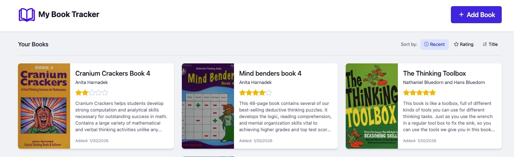
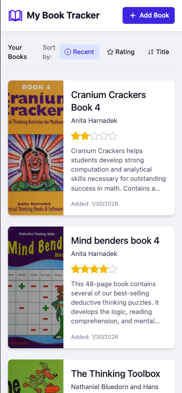

# My Book Tracker 📚

## Description
A personal digital library that helps me keep track of my reading journey. 

## ✨ Key Features:
* **Visual Library Display** – Beautiful grid layout with book covers
* **Smart Sorting System** – Organize books by date, rating, or title
* **Complete Book Management** – Add, edit, and delete books with ease
* **OpenLibrary Integration** – Automatic cover image fetching via ISBN
* **Rating System** – 5-star visual rating display

## 🔧 Tech Stack
* Node.js + Express – Backend server
* EJS – Templating engine for rendering dynamic pages
* Tailwind CSS – Styling
* JavaScript (ES6) – Client and server logic
* PostgreSQL - Database

## 🖼️ Screenshots
### Desktop:

### Mobile:

## 📜 License
This project is open source and available under the MIT License.

## 📋 Planned Features

### 👥 User Accounts & Personalization
- **User Registration & Authentication**: Allow users to create accounts and log in securely
- **Personal Bookshelves**: Each user maintains their own collection of books and reading history 

## 🌐 Live Application
[My Reading Journal](https://book-tracker-9cga.onrender.com)

* Deployed on render
* Database hosted on Neon.tech as render has limitations

### Reference Materials:
* [Express](https://expressjs.com/en/starter/installing.html)
* [Node.js](https://nodejs.org/docs/latest/api/)
* [PostgreSQL](https://www.postgresql.org/docs/current/index.html)
* [Node Postgres](https://node-postgres.com/apis/pool)
* [Tailwind CSS](https://tailwindcss.com/docs/installation/tailwind-cli)
* [Deployment](https://www.freecodecamp.org/news/how-to-deploy-nodejs-application-with-render/)